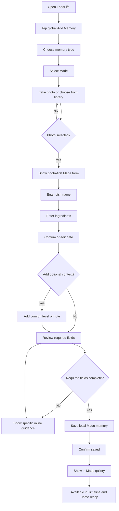
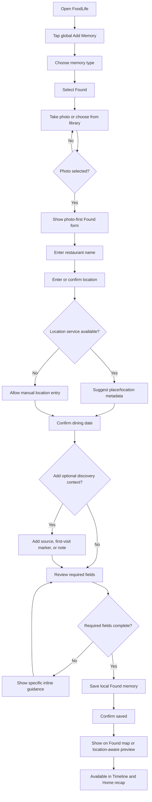
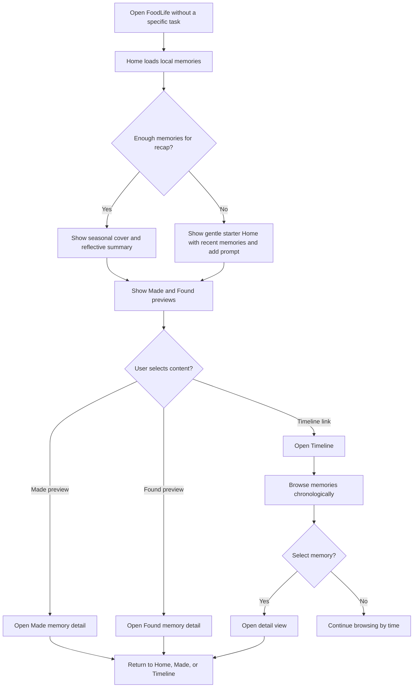
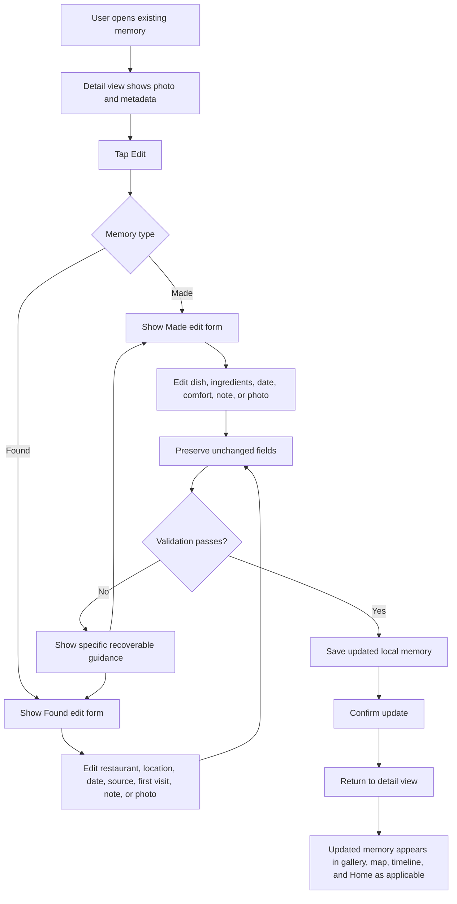

# UX Design Specification FoodLife

**Author:** yiming
**Date:** 2026-05-02

---

<!-- UX design content will be appended sequentially through collaborative workflow steps -->

## Executive Summary

### Project Vision

FoodLife is a private, photo-first food lifestyle archive for preserving food the user made at home and food they found while dining out. The UX should make each saved item feel like a personal memory rather than a recipe record, restaurant review, nutrition entry, or social post.

The product is organized around two emotional worlds: Made and Found. Made represents home cooking, comfort, ingredients, authorship, and warmth. Found represents dining-out happiness, place discovery, restaurant context, and personal exploration. Home and Timeline bring these worlds together through seasonal reflection and chronological rediscovery.

### Target Users

The primary user is a single personal archivist of food memories: someone who takes food photos, wants to remember meaningful meals, and values emotional recall over public sharing or quantified tracking.

This user wants to quickly save a memory in the moment, add only enough context to make it meaningful later, and return weeks or months afterward to revisit what they cooked, where they ate, and how those memories shaped a season of life.

The user may use iOS most often for capture and mobile browsing, while the web app must still support full create, edit, browse, and detail workflows across mobile, tablet, desktop, and wide desktop viewports.

### Key Design Challenges

The UX must preserve the Made / Found emotional split without fragmenting the product into two unrelated apps. Navigation, detail views, capture flows, and combined views should share a recognizable system while allowing Made and Found to carry distinct moods.

The Add Memory flow must stay lightweight and photo-led. It should avoid the feeling of filling out a database by asking for Made or Found first, then a photo, then only the required type-specific fields.

The Found map must feel like a personal food memory map rather than a restaurant search or review interface. It must also degrade gracefully when map tiles or geocoding are unavailable.

The Home experience must communicate seasonal reflection without becoming an analytics dashboard. Counts may support the story, but photos and human language should lead.

Responsive and accessible behavior must be designed from the beginning so photos, metadata, controls, and Made/Found distinctions remain clear across iOS and web.

### Design Opportunities

FoodLife can create a strong product identity by replacing common food-app patterns with memory-first patterns: ratings become discovery notes, recipes become ingredient memories, dashboards become seasonal reflections, and restaurant search becomes a personal map of places already found.

The Made gallery can become a warm visual archive of comfort and authorship, while the Found map can become a bright record of personal exploration. This gives each primary section a browsing metaphor that matches its emotional meaning.

The seasonal Home view can become the long-term delight mechanism. As the archive grows, FoodLife can reflect the user's food life back through human-language seasonal chapters, standout photos, and simple Made/Found context.

The shared local-first model can support a consistent cross-platform experience while leaving room for future cloud sync, richer seasonal recaps, and selective sharing without changing the MVP's private memory-first character.

## Core User Experience

### Defining Experience

The core FoodLife experience is saving and rediscovering a personal food memory with minimal friction. The defining loop is: choose whether the memory was Made or Found, anchor it with a photo, add only the context needed to make it meaningful later, then see it appear in the correct browsing world.

The Add Memory flow is the most critical interaction to get right. If capture feels heavy, the archive will not grow. If classification feels unclear, the Made / Found product spine weakens. If saved memories do not immediately feel preserved and easy to revisit, the product loses its emotional value.

The everyday experience should feel like keeping a personal food-life album alive: quick capture in the moment, calm browsing afterward, and periodic rediscovery through Home and Timeline.

### Platform Strategy

FoodLife v1 is designed for a native iOS app and a full browser-based web app. Both platforms must support the same conceptual product structure: Home, Made, Found, Timeline, Add Memory, and Detail View.

The iOS app should prioritize in-the-moment capture, camera and photo-library access, location capture for Found memories, smooth gallery browsing, and quick return to saved memories. It should feel natural for touch use and current iPhone patterns.

The web app should provide the complete archive experience across mobile, tablet, desktop, and wide desktop viewports. It should support create, edit, browse, and detail workflows, with responsive layouts that preserve photo hierarchy and readable metadata.

Both platforms should express the same UX model while respecting platform strengths. iOS can emphasize fast capture and native device capabilities. Web can emphasize larger browsing surfaces, timeline scanning, and comfortable editing.

### Effortless Interactions

Choosing Made or Found should require almost no thought. The options should be clear, visually distinct, and emotionally understandable: Made means food I cooked; Found means food or places I discovered.

Photo capture or selection should feel like the first real action, not a later attachment step. The photo is the memory anchor, so the flow should start from the image and let metadata support it.

Saving should require only the minimum necessary fields. Made should ask for photo, dish name, ingredients, and date. Found should ask for photo, restaurant, location, and dining date. Optional fields should be available without making the form feel longer than it is.

After saving, the user should immediately understand where the memory went. A Made memory should appear in the Made gallery. A Found memory should appear in the Found map or location-based browsing surface. Both should also become available through Timeline and seasonal Home content.

Editing later should feel forgiving. The user should be able to correct missing or imperfect details without worrying that the original photo or saved memory will be disrupted.

### Critical Success Moments

The first success moment is creating a memory without feeling like the app asked for too much. The user should feel that FoodLife captured the moment, not that they completed an administrative task.

The second success moment is seeing the saved memory in the right emotional context. A Made memory should feel at home in a warm gallery. A Found memory should feel tied to place and discovery.

The long-term success moment is opening FoodLife after several weeks or months and seeing a seasonal Home recap that feels personally meaningful. The archive should begin to reflect the user's food life back to them.

The most fragile moments are photo handling, save reliability, and location handling. If photos disappear, saved records fail, or Found memories cannot preserve location context when map services are unavailable, trust in the archive breaks.

### Experience Principles

Photo first, metadata second. Food photos carry the emotional memory; fields exist to make that memory findable and meaningful later.

Type first, form second. Made and Found should be chosen before details so the flow, language, and metadata match the memory type immediately.

Two moods, one system. Made and Found should feel emotionally distinct while sharing enough structure that the app remains coherent and easy to learn.

Reflection over analytics. Home and Timeline should help the user revisit life through food, not measure productivity, health, spending, or restaurant quality.

Forgiving by default. Users should be able to save quickly, complete details later, and trust that local memories and photos remain intact.

## Desired Emotional Response

### Primary Emotional Goals

FoodLife should make users feel that their food life is worth remembering. The primary emotional response is personal warmth: the sense that ordinary meals, homemade dishes, restaurant discoveries, and small food moments can become meaningful memories over time.

Made should create feelings of comfort, authorship, calm, and home. The user should feel that the food they cooked has been preserved as something personal, not converted into a recipe task or productivity record.

Found should create feelings of happiness, discovery, lightness, and place-based memory. The user should feel the pleasure of remembering where they went, what they found, and why that meal mattered.

Home should create reflective delight. It should feel like opening a seasonal chapter of the user's own life, not checking a dashboard.

### Emotional Journey Mapping

When first opening FoodLife, the user should feel oriented and invited. The app should immediately communicate that it is a private food-memory archive with two clear worlds: Made and Found.

During Add Memory, the user should feel momentum and confidence. The flow should confirm that only a few details are needed and that the photo is the heart of the memory.

After saving, the user should feel a small sense of preservation: the moment has been captured and placed somewhere meaningful. A Made memory should feel settled into a personal gallery. A Found memory should feel anchored to a place or discovery.

When browsing later, the user should feel recognition, nostalgia, and gentle curiosity. The app should make it easy to revisit what was cooked, where food was discovered, and how those memories connect across time.

When something goes wrong, the user should feel protected rather than punished. If map services are unavailable, if location details are incomplete, or if optional fields are skipped, the memory should still be preserved.

### Micro-Emotions

FoodLife should create confidence instead of confusion by making Made and Found classification obvious and using type-specific language throughout the experience.

It should create trust instead of skepticism by making saved photos, dates, locations, and notes feel durable, editable, and locally preserved.

It should create delight instead of pressure through seasonal recaps, photo-led browsing, and small moments of recognition, without introducing social comparison, ratings, or heavy metrics.

It should create calm instead of administrative friction by keeping forms short, optional fields clearly optional, and editing forgiving.

It should create nostalgia instead of cold recordkeeping by using human language, chronological continuity, seasonal grouping, and photo-first detail views.

### Design Implications

Warmth requires softer Made surfaces, calm gallery pacing, ingredient context, and language that reinforces home cooking as personal authorship.

Discovery requires brighter Found accents, visible place context, map-first browsing, and photo-led pins or previews where feasible.

Trust requires clear save states, persistent local records, editable details, graceful fallback for missing map services, and no destructive surprises when editing.

Low friction requires a type-first Add Memory flow, photo-first capture, a short required field set, and optional details that do not visually overwhelm the form.

Reflection requires Home to prioritize seasonal narrative, standout photos, and lightweight contextual statements over charts, analytics, rankings, or quantified dashboards.

Accessibility requires emotional distinctions to be conveyed through labels, structure, and iconography, not color alone.

### Emotional Design Principles

Make memory feel preserved, not processed.

Let photos carry emotion and let metadata quietly support recall.

Use Made and Found as emotional language, not just categories.

Keep capture light enough that users will actually do it in the moment.

Make returning to the archive feel rewarding as the user's food life accumulates.

Protect the private, personal feeling by avoiding social, rating, nutrition, and analytics patterns in the MVP.

## UX Pattern Analysis & Inspiration

### Inspiring Products Analysis

FoodLife should borrow from iOS Photos Memories for emotional resurfacing. The relevant pattern is not automatic slideshows alone, but the way photos become meaningful when grouped by time, season, and personal context. FoodLife can adapt this for Home by presenting seasonal food-life chapters with standout photos, human language, and light Made / Found context.

FoodLife should borrow from map and travel products for Found. The relevant pattern is place-based memory: locations are not just coordinates, they are anchors for stories. Found should use map browsing to help the user remember places personally discovered, while avoiding restaurant-search and review-app patterns.

FoodLife should borrow from personal cookbook aesthetics for Made. The relevant pattern is warmth, authorship, and ingredient recall. Made should feel like a visual archive of home comfort, but it should not adopt recipe-builder complexity, step-by-step cooking flows, or meal-planning structures.

FoodLife should borrow from private journaling products for tone and trust. The relevant pattern is low-pressure capture: a photo, a few details, optional notes, and the confidence that the record is private and editable. This supports the product's local-first and personal-memory goals.

### Transferable UX Patterns

Photo-led collection browsing should be used across Made, Timeline, Home, and detail views. Photos should define the first visual impression, while metadata appears as supporting context.

Seasonal and chronological grouping should guide Home and Timeline. The user should be able to understand their archive through lived time rather than manual folders or complex taxonomy.

Map-first place browsing should guide Found. The map should present the user's remembered food places, with saved restaurant/location context and photo previews where feasible.

Type-first capture should guide Add Memory. The first decision should be Made or Found so the form, mood, required fields, and labels immediately match the user's intent.

Progressive detail disclosure should keep browsing calm. Gallery, map, and timeline views should avoid exposing every field at once; detail views can reveal the fuller memory.

Forgiving editing patterns should support trust. Users should be able to update details later without damaging photo associations or saved context.

### Anti-Patterns to Avoid

Avoid restaurant-review patterns: star ratings, public reviews, ranking language, price analysis, and Yelp-like discovery. These shift Found away from personal memory and toward evaluation.

Avoid full recipe-management patterns: cooking steps, servings, prep time, nutrition, meal planning, and rigid ingredient structures. These shift Made away from comfort memory and toward productivity.

Avoid quantified-self dashboards: charts, heavy counts, streaks, calorie summaries, spending summaries, or performance-style analytics. These conflict with Home as seasonal reflection.

Avoid social-feed patterns: likes, followers, public posting, engagement metrics, and performative sharing. FoodLife should feel private by default.

Avoid generic database forms. Long forms, dense metadata, required optional context, and admin-like labels would reduce capture frequency and weaken emotional value.

Avoid color-only type distinctions. Made and Found must be differentiated through labels, icons, layout, and content structure as well as visual mood.

### Design Inspiration Strategy

Adopt photo-led hierarchy from memory and gallery products because FoodLife's emotional value begins with the food photo.

Adapt seasonal resurfacing from photo-memory products into food-specific Home chapters that combine Made and Found without becoming analytics.

Adapt map browsing from travel and maps products into a personal Found map that remembers places already discovered rather than searching for new restaurants.

Adapt private journaling patterns into lightweight notes, forgiving edits, and local-first trust cues.

Use cookbook warmth selectively for Made, emphasizing comfort, ingredients, and authorship while excluding full recipe management.

Preserve FoodLife's uniqueness by treating all borrowed patterns as memory-first patterns. The app should never become a restaurant app, recipe app, nutrition tracker, social network, or analytics dashboard.

## Design System Foundation

### 1.1 Design System Choice

FoodLife should use a themeable design-system approach: shared product-level design tokens and component principles, implemented with platform-native or platform-appropriate component foundations.

For the iOS app, the design should align with native iOS interaction patterns, accessibility behavior, typography scaling, navigation conventions, camera/photo-library affordances, and map behavior. Custom styling should sit on top of familiar native patterns rather than fighting them.

For the web app, the design should use a customizable component foundation that supports responsive layouts, accessible controls, keyboard interaction, form states, dialogs/sheets, tabs, segmented controls, cards, galleries, map overlays, and detail views. The exact web library can be chosen during implementation, but the UX specification should define the design tokens, component behavior, and FoodLife-specific patterns independent of one library.

### Rationale for Selection

A fully custom design system would provide maximum uniqueness but would add unnecessary upfront design and implementation cost for an MVP. FoodLife needs polish and emotional specificity, but the product should first prove the Made / Found memory model, not spend MVP effort inventing every primitive.

A rigid established design system would speed implementation but could make FoodLife feel generic. The product requires warm Made surfaces, bright Found treatments, seasonal Home reflection, and photo-led browsing. These emotional needs require more customization than a default component library usually provides.

A themeable system provides the right balance. It supports consistent accessibility, responsive behavior, and maintainable components while allowing FoodLife to express its own visual identity through tokens, content hierarchy, imagery, and type-specific patterns.

### Implementation Approach

The design system should be organized around shared tokens and reusable interaction patterns rather than identical platform rendering.

Core shared tokens should include color roles, typography roles, spacing, corner radius, elevation or depth, motion duration, photo aspect ratios, focus states, and semantic Made / Found / Home / Timeline roles.

Core shared components should include navigation, global add control, Made / Found selector, photo picker entry point, memory card, photo grid item, timeline item, map memory preview, detail header, editable field group, form action bar, empty state, permission prompt, offline/map fallback state, and seasonal recap module.

Platform implementations may differ visually where appropriate, but they should preserve the same information hierarchy, emotional intent, accessibility outcomes, and user flow behavior.

### Customization Strategy

FoodLife should customize the design system around three emotional modes:

Made mode should use warmer surfaces, calmer pacing, ingredient-forward metadata, soft gallery rhythm, and language that emphasizes home cooking and personal authorship.

Found mode should use brighter accents, location-forward metadata, map-first browsing, place anchors, and language that emphasizes discovery and happy dining memories.

Whole-life mode should be used for Home and Timeline, combining Made and Found through seasonal grouping, chronological continuity, photo-led presentation, and reflective language.

Customization should also define non-color type cues. Made and Found must be distinguishable through labels, icons, layout structure, and metadata hierarchy, not color alone.

The design system should preserve MVP restraint. It should avoid decorative complexity, social-feed components, rating widgets, analytics charts, nutrition dashboards, and recipe-builder modules unless future scope explicitly changes.

## 2. Core User Experience

### 2.1 Defining Experience

FoodLife's defining experience is preserving a food memory in the right emotional context.

The user begins by choosing whether the memory was Made or Found. They then add or capture a food photo, enter the smallest useful set of details, and save the memory into the appropriate browsing world. A Made memory joins the warm personal gallery. A Found memory joins the place-aware discovery map. Both become available through Timeline and seasonal Home reflection.

This interaction should be easy to describe: "I save food I made or places I found, then FoodLife turns them into my personal food-life archive."

The experience succeeds when the user feels that the app understood the memory before asking for too much information.

### 2.2 User Mental Model

Users currently solve this problem with scattered tools: camera rolls, notes, map saves, restaurant bookmarks, recipe apps, chat messages, or memory alone. These tools preserve fragments but do not connect food photos, context, place, and time into one private archive.

The user's mental model is closer to "save this moment" than "create a record." They expect the photo to come first because food memories usually begin with a picture. They expect optional details to help future recall, not to become a required data-entry task.

For home cooking, the user thinks in terms of dish, ingredients, date, and personal context. For dining out, the user thinks in terms of restaurant, place, date, discovery, and memory. The UX should match these mental models directly.

Likely confusion points include unclear Made / Found classification, too many form fields, map behavior that feels like restaurant search, and Home content that feels like analytics instead of reflection.

### 2.3 Success Criteria

The defining experience succeeds when the user can classify a memory, add a photo, complete required fields, and save without friction or uncertainty.

The user should always know which type of memory they are creating, which fields are required, which fields are optional, and where the memory will appear after saving.

The flow should feel fast enough for in-the-moment capture. After photo selection, each memory type should require no more than the PRD-defined essential metadata: dish name, ingredients, and date for Made; restaurant, location, and dining date for Found.

The system should provide clear completion feedback: the memory is saved, locally preserved, and visible in the correct destination.

The user should feel safe saving an imperfect memory because editing later is supported and optional context can be completed later.

### 2.4 Novel UX Patterns

FoodLife does not require a completely novel interaction model. It combines familiar patterns in a distinctive way: photo capture, segmented type choice, lightweight forms, galleries, maps, timelines, and seasonal recaps.

The unique twist is emotional classification. Made and Found are not just data categories; they change the mood, field language, browsing metaphor, and memory destination.

The app should not over-teach this pattern. It should make the difference self-evident through labels, examples, icons, visual tone, and destination feedback.

The most novel product pattern is the personal food-life Home: a seasonal recap that combines Made and Found without becoming analytics. This can use familiar photo-memory patterns while remaining food-specific.

### 2.5 Experience Mechanics

**Initiation:**  
The user starts from a global Add Memory control available from primary navigation. The control opens a type-first choice between Made and Found.

**Type Selection:**  
Made and Found are presented as two clear choices with short descriptions, distinct icons, and emotional cues. Made should communicate food cooked by the user. Found should communicate food or places discovered outside.

**Photo Anchor:**  
After type selection, the user is prompted to take a photo or choose one from the photo library. The selected photo becomes the visual anchor for the memory and should remain visible during detail entry.

**Detail Entry:**  
The form adapts to the selected type. Made asks for dish name, ingredients, and date, with optional comfort level and note/context. Found asks for restaurant, location, and dining date, with optional discovery source, first-visit marker, and note/context.

**Feedback and Validation:**  
Required fields are clearly marked without making optional fields feel secondary or hidden. Validation should be plain, specific, and recoverable. The app should avoid blocking save for optional context.

**Completion:**  
On save, the app confirms the memory was preserved and routes or previews it in the correct destination. Made should connect to the gallery; Found should connect to the map or location-aware browsing surface.

**Recovery and Editing:**  
From detail view, the user can edit metadata and photo references. Unchanged fields should remain preserved, and editing should not feel like fixing a mistake.

## Visual Design Foundation

### Color System

FoodLife should use the Porcelain & Market Green palette as its primary visual foundation.

Core palette:

- Background: `#F7F5F0`
- Surface: `#FFFFFF`
- Text: `#24221F`
- Made: `#C1A79C`
- Found: `#7CB342`
- Seasonal: `#B9A36A`
- Accent: `#1E9E8A`
- Muted: `#7B7770`

The overall system should be elegant, soft, and photo-first. Made and Home should retain the porcelain-like neutral foundation with light warm clay accents. Found should be allowed to feel more vivid and fresh through Market Green, creating a distinct discovery style without making the whole app loud.

Made color usage should be warm, light, and restrained: section markers, selected states, subtle chips, metadata emphasis, and small accents around home-cooked memories. Because the Made color is intentionally soft, text should use the main text color or a darker derived clay tone when contrast is required.

Found color usage should be brighter and more energetic: map markers, discovery indicators, active Found navigation, location metadata, and place-based preview states.

Seasonal color should support Home recaps and time-based reflection. It should be used carefully for chapter labels, recap highlights, and seasonal modules rather than as a dominant background.

The teal accent should be reserved for secondary actions, map-related affordances, and cross-mode moments where the product needs freshness without using the main Found green.

### Typography System

The typography should feel modern, readable, and quietly elegant. It should avoid decorative food-blog styling and avoid overly technical dashboard styling.

The system should use a clean sans-serif foundation on both platforms, with native iOS typography behavior respected in the iOS app. The web app can use a high-quality system or web-safe sans-serif stack unless implementation later selects a specific brand font.

Type hierarchy should prioritize photo captions, dish or restaurant names, dates, locations, and short memory notes. Long-form reading is not the primary content model, so typography should support scanning and emotional recognition rather than dense article reading.

Recommended hierarchy:

- Screen title: clear, calm, and not oversized inside app surfaces.
- Section title: compact and scannable for Home, Made, Found, and Timeline modules.
- Memory title: dish name or restaurant name should be the strongest text element after the photo.
- Metadata: date, ingredients, location, discovery source, and comfort context should be readable but secondary.
- Notes: comfortable line height for short personal text.

### Spacing & Layout Foundation

FoodLife should use an 8px spacing foundation with calm, consistent rhythm. Layouts should feel spacious enough for photos to breathe but not so airy that the app becomes a marketing page.

Photo-led surfaces should use stable aspect ratios and predictable grids:

- Made gallery: image-first grid with consistent spacing and calm rhythm.
- Found map: map-first layout with photo-led place previews and clear location metadata.
- Timeline: chronological list or grouped photo rows with enough spacing to distinguish entries.
- Home: seasonal modules that combine standout photos, short narrative text, and lightweight Made / Found context.

Cards should remain restrained, with corner radius no larger than 8px unless platform-native components require otherwise. The app should avoid nested cards and heavy decorative containers. Photos, white surfaces, subtle borders, and spacing should create structure.

On desktop web, layouts can use wider browsing surfaces and multi-column photo grids. On mobile, the experience should prioritize thumb reach, clear bottom navigation or native tab behavior, and forms that avoid crowding.

### Accessibility Considerations

Color cannot be the only distinction between Made and Found. The app must pair color with labels, icons, metadata structure, and section context.

Text contrast must meet WCAG 2.2 AA targets for the web app. The Found green should be used carefully for text; when contrast is insufficient, it should be used as a fill, border, icon, or marker alongside dark readable text.

Interactive states must include visible focus indicators on web and platform-appropriate accessibility focus on iOS. Forms, map previews, gallery items, and timeline entries should all have accessible names that include memory type and identifying metadata.

Food photos must not be the only identifier for a memory. Browsing and detail surfaces should expose dish name, restaurant name, date, location, or other text context.

The visual system must support readable text scaling, non-overlapping layouts, and clear hit targets across mobile, tablet, desktop, and wide desktop viewport classes.

## Design Direction Decision

### Design Directions Explored

The design direction exploration produced six screen-level directions using the selected Porcelain & Market Green visual foundation:

- Seasonal Cover Home: a Home experience led by one emotional seasonal image, supported by recent Made and Found memories.
- Made Gallery Calm: a restrained photo gallery for home-cooked food, with ingredient context revealed progressively.
- Found Map Fresh: a brighter map-led Found experience with vivid green discovery markers and photo-led place previews.
- Timeline as Food Life: a chronological mixed view where Made and Found remain distinguishable through labels, accents, and metadata hierarchy.
- Photo-First Capture: a type-first Add Memory flow where Made or Found is chosen before the photo and lightweight details.
- Editorial Detail View: a detail page that treats the photo as the main memory object and metadata as a quiet caption system.

### Chosen Direction

FoodLife should use a combined screen-specific design direction rather than one uniform layout pattern across all screens.

Home should use Seasonal Cover Home. It should feel like opening the current chapter of the user's food life, with a standout seasonal image, reflective copy, and supporting Made / Found memory previews.

Made should use Made Gallery Calm. It should prioritize a warm, quiet, photo-led gallery where home-cooked memories feel personal and unhurried. The lighter Made clay should be used as a soft supporting accent rather than a dominant color.

Found should use Found Map Fresh. It should be visually distinct from Made by using vivid Market Green for map markers, location cues, active states, and discovery moments. Found can be brighter and more energetic than Made while still living inside the same elegant product system.

Timeline should use Timeline as Food Life. It should combine Made and Found chronologically while preserving type recognition through labels, icons, metadata structure, and color accents.

Add Memory should use Photo-First Capture. It should begin with the Made / Found choice, keep the selected photo visible during detail entry, and limit required metadata to the fields defined in the PRD.

Detail View should use Editorial Detail View. It should make the food photo dominant, then present dish or restaurant name, date, ingredients or location, and optional notes as calm supporting context.

### Design Rationale

This combined direction supports FoodLife's core product spine: Made and Found share one archive model but deserve different emotional treatments. A single visual pattern would flatten the distinction between home comfort and outside discovery. Separate screen-specific patterns let each area use the metaphor that best fits its purpose.

The chosen direction keeps the product elegant by using porcelain neutrals, white surfaces, restrained cards, stable photo ratios, and calm typography. It also allows Found to feel vivid and fresh through Market Green, which creates the happiness and discovery energy requested for dining-out memories.

The approach also preserves implementation clarity. Each primary surface has a clear job: Home reflects, Made browses by gallery, Found browses by map, Timeline orders by time, Add Memory captures, and Detail View preserves context.

### Implementation Approach

The implementation should treat this as one shared design system with mode-specific screen patterns.

Shared system elements include navigation, global Add Memory control, typography, spacing, photo ratios, card constraints, form controls, focus states, and memory metadata structure.

Mode-specific elements include Made gallery treatment, Found map markers and place previews, Home seasonal modules, Timeline grouping, Add Memory type selection, and Detail View metadata hierarchy.

The design should avoid forcing one layout across all areas. Consistency should come from tokens, interaction behavior, accessibility rules, and information hierarchy rather than identical screen composition.

The HTML showcase at `_bmad-output/planning-artifacts/ux-design-directions.html` should be treated as an exploratory reference, not a production mockup. Detailed design work may refine spacing, component states, and responsive behavior while preserving the selected screen-level direction.

## User Journey Flows

### Capturing a Made Memory

The Made capture flow should feel like preserving something cooked at home, not creating a recipe. The user starts from the global Add Memory control, chooses Made, anchors the entry with a photo, enters only lightweight required context, and sees the memory appear in the Made gallery.

Key UX requirements:

- The Made choice should use warm, home-oriented language and light Made clay accents.
- The selected photo should remain visible while details are entered.
- Optional comfort and note fields should be available without making the form feel long.
- Save confirmation should make the user feel the memory was preserved locally.

### Capturing a Found Memory

The Found capture flow should feel like preserving a dining-out discovery. The user starts from Add Memory, chooses Found, anchors the memory with a photo, captures restaurant and location context, and sees the memory join the Found map.

Key UX requirements:

- Found can use vivid Market Green for map markers, active states, and discovery moments.
- Map or geocoding failure must not block saving when manual restaurant and location metadata are provided.
- The flow should avoid ratings, public review language, restaurant search framing, or price evaluation.
- Completion should make the place feel remembered, not listed.

### Rediscovering Food Life Through Home and Timeline

Rediscovery should create long-term value after the user has saved multiple memories. Home provides a seasonal reflection, while Timeline gives chronological continuity across Made and Found.

Key UX requirements:

- Home should use seasonal language, photos, and light context rather than charts or dashboards.
- Timeline should distinguish Made and Found through labels, icons, metadata hierarchy, and accents.
- Empty or low-data states should remain emotionally aligned and invite capture without pressure.
- Rediscovery should support recognition and nostalgia, not productivity tracking.

### Correcting or Completing a Memory Later

Editing should preserve trust in the archive. The user may return to fix a date, add an ingredient, correct a restaurant name, complete a location, or add a note after the memory has already been saved.

Key UX requirements:

- Editing should feel like completing a memory, not fixing a mistake.
- Unchanged fields and photo references must be preserved.
- Type-specific edit forms should mirror the original capture structure.
- Save/update feedback should reinforce local preservation and data integrity.

### Journey Patterns

All critical flows should use type-first structure where Made and Found decisions affect language, required fields, visual mood, and destination.

All capture and edit flows should keep the photo visible or easily reachable because the photo is the memory anchor.

All forms should separate required fields from optional context without visually burying optional emotional details.

All success states should show where the memory now lives: Made gallery, Found map, Timeline, Home recap, or Detail View.

All error states should be specific, inline, and recoverable. They should never imply that the user has lost the photo or memory.

### Flow Optimization Principles

Minimize steps to preservation. A user should be able to save the memory with only the required fields for that type after photo selection.

Preserve emotional context. Made flows should stay warm and calm; Found flows should stay vivid and discovery-oriented.

Make recovery safe. Map services, geocoding, incomplete optional fields, and later edits should not threaten saved photos or metadata.

Use progressive disclosure. Browsing views should show enough context to recognize a memory, while detail and edit views reveal the fuller record.

Keep combined views legible. Home and Timeline can combine Made and Found, but they must preserve type clarity through labels, icons, metadata structure, and non-color cues.

## Component Strategy

### Design System Components

FoodLife should rely on platform-appropriate foundation components for common UI primitives. The UX specification should define behavior, hierarchy, and tokens while allowing implementation to use native iOS components and an accessible, themeable web component foundation.

Foundation components include:

- App navigation and tab navigation.
- Buttons, icon buttons, and global Add Memory action.
- Segmented controls or choice controls for mode selection.
- Text inputs, text areas, date inputs, and validation messages.
- Sheets, dialogs, popovers, and confirmation surfaces.
- Form groups, action bars, and save/cancel controls.
- Tabs, lists, grids, and scroll containers.
- Focus states, disabled states, loading states, and error states.
- Permission prompts and platform-native camera, photo-library, and location affordances.

These components should inherit FoodLife tokens for color, typography, spacing, radius, and focus treatment. They should not introduce social, rating, nutrition, recipe-builder, or analytics-specific widgets in the MVP.

### Custom Components

#### Made / Found Selector

**Purpose:** Lets the user classify a memory before entering details.

**Usage:** First step in Add Memory and any place where type selection is required.

**Anatomy:** Two choices with label, icon, short description, and selected state.

**States:** Default, hover/focus on web, selected, disabled, validation-needed.

**Variants:** Full card selector for capture; compact segmented selector for filters or edit contexts if needed.

**Accessibility:** Each option must have a clear accessible name and description. Selection state must be programmatically exposed. Color must be paired with label and icon.

**Content Guidelines:** Made means food cooked by the user. Found means food or places discovered outside.

**Interaction Behavior:** Selecting a type immediately changes form fields, tone, and destination context.

#### Photo Picker Entry Point

**Purpose:** Makes the photo the anchor of memory capture.

**Usage:** Add Memory and edit photo flows.

**Anatomy:** Photo preview area, take photo action, choose from library action, replace/remove affordance where appropriate.

**States:** Empty, photo selected, loading/importing, permission needed, error, replace mode.

**Variants:** Large capture version, compact edit version.

**Accessibility:** Actions need explicit labels for taking, choosing, replacing, or removing a photo. The selected photo needs identifying alt/accessibility text based on memory metadata when available.

**Interaction Behavior:** After selection, the photo remains visible during detail entry.

#### Memory Card

**Purpose:** Represents a saved memory in browse surfaces.

**Usage:** Home previews, Made gallery, Timeline, and possibly Found list previews.

**Anatomy:** Photo, memory type label, dish or restaurant name, date, and one supporting metadata line.

**States:** Default, hover/focus, pressed, loading image, missing image fallback.

**Variants:** Made card, Found card, compact preview, large featured card.

**Accessibility:** Card accessible name should include type, title, date, and primary context. Focus order must be predictable.

**Interaction Behavior:** Opens Detail View. It should not expose edit controls directly unless in an explicit management mode.

#### Made Gallery Item

**Purpose:** Supports warm, calm browsing of home-cooked memories.

**Usage:** Made gallery grid.

**Anatomy:** Stable-ratio photo, dish name, ingredient preview, date or comfort context.

**States:** Default, hover/focus, selected/opening, image loading, empty image fallback.

**Variants:** Standard grid item, larger featured item.

**Accessibility:** Must expose dish name and date or ingredient context so the photo is not the only identifier.

**Interaction Behavior:** Opens Made Detail View with ingredient and note context.

#### Found Map Marker

**Purpose:** Anchors Found memories on a personal discovery map.

**Usage:** Found map.

**Anatomy:** Vivid Market Green marker, optional photo thumbnail treatment, selected state, cluster state if needed later.

**States:** Default, hover/focus, selected, active preview, unavailable map fallback.

**Variants:** Single memory marker, multiple memories at same location, first-visit marker.

**Accessibility:** Map markers must be reachable or represented in an accessible list alternative. Labels should include restaurant, location, and date when available.

**Interaction Behavior:** Selecting a marker opens a photo-led map preview rather than a restaurant listing.

#### Map Memory Preview

**Purpose:** Shows Found memory details from the map without leaving the map context immediately.

**Usage:** Found map selected marker state.

**Anatomy:** Photo, restaurant name, location, date, first-visit or discovery context, open detail action.

**States:** Default, loading, selected, missing map service fallback.

**Variants:** Bottom sheet on mobile; side or floating panel on tablet and desktop.

**Accessibility:** Must be keyboard reachable on web and screen-reader understandable as a selected memory preview.

**Interaction Behavior:** Opens Found Detail View or dismisses back to the map.

#### Timeline Item

**Purpose:** Represents a Made or Found memory in chronological context.

**Usage:** Timeline view and possibly Home seasonal groups.

**Anatomy:** Date grouping, photo thumbnail, type label/icon, title, primary metadata.

**States:** Default, hover/focus, pressed, image loading.

**Variants:** Made timeline item, Found timeline item, grouped month/season header.

**Accessibility:** Must communicate type without relying on color.

**Interaction Behavior:** Opens Detail View and preserves return path to Timeline.

#### Seasonal Recap Module

**Purpose:** Turns local memories into a reflective Home chapter.

**Usage:** Home screen.

**Anatomy:** Seasonal title, standout photo or photo group, short reflective copy, Made and Found previews, link to Timeline or related details.

**States:** Enough memories, few memories, no memories, loading local recap, unavailable photo fallback.

**Variants:** Featured Home module, smaller recap module, empty starter module.

**Accessibility:** Recap should be readable as text and not depend on photo collage alone.

**Interaction Behavior:** Lets users open related memory details or move into Timeline.

#### Detail Header

**Purpose:** Presents the memory as an editorial photo-led object.

**Usage:** Made and Found Detail View.

**Anatomy:** Large photo, type label, title, date, primary context, edit action.

**States:** Default, loading image, missing image fallback, edit mode transition.

**Variants:** Made detail header, Found detail header.

**Accessibility:** Header must expose type, title, date, and context. Edit action must be clearly named.

**Interaction Behavior:** Leads into metadata groups and edit flow.

#### Editable Field Group

**Purpose:** Supports forgiving create and edit forms.

**Usage:** Add Memory and Detail Edit.

**Anatomy:** Label, input, optional/helper text, validation message, required indicator.

**States:** Default, focus, filled, error, disabled, optional, saving.

**Variants:** Made fields, Found fields, photo-associated fields, date/location fields.

**Accessibility:** Labels and validation messages must be programmatically associated with inputs.

**Interaction Behavior:** Preserves unchanged values on edit and clearly differentiates required fields from optional context.

#### Empty, Permission, and Fallback States

**Purpose:** Keep the app usable and emotionally aligned when data or platform services are unavailable.

**Usage:** Empty Made gallery, empty Found map, no Timeline entries, photo permission denied, location unavailable, map service unavailable.

**Anatomy:** Clear title, short explanation, relevant action, non-alarming tone.

**States:** Empty archive, permission denied, service unavailable, local data loading, failed save.

**Variants:** Made empty state, Found empty state, Home starter state, map fallback state.

**Accessibility:** Must be announced clearly and provide reachable actions.

**Interaction Behavior:** Preserve memory creation and local metadata wherever possible, especially when map/geocoding services fail.

### Component Implementation Strategy

Build components from shared tokens and behavior contracts rather than relying on pixel-identical iOS and web rendering. Platform implementations may differ, but they must preserve information hierarchy, flow order, accessibility outcomes, and Made / Found emotional intent.

Use composition over one-off screens. Memory Card, Photo Picker, Editable Field Group, and Detail Header should be reusable across create, edit, browse, and detail flows.

Define explicit variants for Made, Found, and whole-life contexts. Made variants use lighter clay support; Found variants use vivid Market Green; Home and Timeline combine both while preserving type clarity.

Treat map-specific components as progressive enhancements. Found memories must remain accessible through preview/list/detail patterns even when map rendering or geocoding is unavailable.

### Implementation Roadmap

Phase 1 - Capture and Local Memory Basics:

- App navigation and global Add Memory action.
- Made / Found Selector.
- Photo Picker Entry Point.
- Editable Field Group.
- Save confirmation and validation states.
- Detail Header for saved memories.

Phase 2 - Primary Browsing:

- Memory Card.
- Made Gallery Item.
- Timeline Item.
- Empty states for Made, Found, Timeline, and Home.
- Detail metadata sections and edit actions.

Phase 3 - Found and Home Experience:

- Found Map Marker.
- Map Memory Preview.
- Map service fallback state.
- Seasonal Recap Module.
- Home memory preview modules.

Phase 4 - Polish and Scale:

- Loading image states.
- Larger desktop gallery variants.
- Accessibility refinements for keyboard and screen-reader browsing.
- First-visit marker variant.
- Future cluster or seasonal enhancement components if post-MVP scope requires them.

## UX Consistency Patterns

### Button Hierarchy

Primary actions should be reserved for committing or starting high-value flows: Add Memory, Save Memory, Update Memory, Choose Photo, and Open Detail from a preview.

Secondary actions should support non-destructive alternatives: Cancel, Back, Edit, Replace Photo, View Timeline, or Open Map/List alternative.

Destructive actions are not central to the MVP, but if delete is introduced it must be visually distinct, require confirmation, and clearly describe what will be removed.

Button labels should use direct verbs. Examples: Add Memory, Save Made Memory, Save Found Memory, Choose Photo, Take Photo, Edit Memory, Open Timeline.

Icon-only buttons may be used for common actions in compact contexts, but must have accessible labels and tooltips on web where appropriate.

### Feedback Patterns

Success feedback should be calm and specific. Saving a memory should confirm that the memory was saved locally and indicate where it now appears, such as Made gallery, Found map, Timeline, or Home.

Error feedback should be inline, recoverable, and specific to the field or service that failed. Errors should not imply that the photo or memory has been lost unless that is truly the case.

Warning feedback should be used for degraded experiences, such as unavailable map services or missing location suggestions. Warnings should preserve the user's path forward, especially manual Found location entry.

Information feedback should explain permissions and local-first behavior in product language. Camera, photo library, and location prompts should connect directly to preserving food memories.

Loading states should be lightweight and should avoid blocking the whole app unless required. Photo loading, map loading, and local recap generation should each have localized states.

### Form Patterns

Forms should be type-specific. Made forms ask for dish name, ingredients, date, optional comfort level, and optional note. Found forms ask for restaurant, location, dining date, optional discovery source, optional first-visit marker, and optional note.

Required fields should be visibly marked and grouped before optional context, but optional fields should remain easy to discover. Optional context is emotionally useful and should not feel hidden.

Validation should occur close to the relevant field. Messages should explain what is needed in plain language, such as "Add a dish name to save this Made memory."

Date fields should default to the most likely date from capture or user input context when possible, while remaining easy to edit.

Edit forms should mirror create forms. Users should not need to learn a separate editing model to correct or complete a memory later.

Save actions should preserve unchanged fields and photo references unless the user explicitly changes them.

### Navigation Patterns

Primary navigation should center on Home, Made, Found, and Timeline, with Add Memory globally available.

Home is for seasonal reflection and recent rediscovery. Made is for gallery-first home-cooked memories. Found is for map-first place discovery. Timeline is for chronological continuity across both types.

Navigation should preserve return context. Opening a detail from Home, Made, Found, or Timeline should allow the user to return to the source surface predictably.

The Add Memory flow should be reachable from primary navigation and should return or route to the relevant destination after save.

On iOS and mobile web, navigation should prioritize thumb reach and clear tab behavior. On desktop web, navigation can use a top or side structure if the same conceptual destinations remain obvious.

### Modal and Overlay Patterns

Sheets and dialogs should be used for focused, interruptible tasks: type selection, photo source selection, permission explanation, confirmation, and map memory previews on smaller screens.

Full-screen flows should be used when the user is creating or editing a memory because the photo and form require sustained attention.

Map previews may be overlays, bottom sheets, or side panels depending on viewport. They must always provide a route to the full detail view and a clear way to dismiss.

Overlays should not stack deeply. If a permission or photo picker is invoked from Add Memory, the user should return to the same flow state afterward.

### Empty, Loading, and Fallback States

Empty states should be emotionally aligned with each section. Made should invite the first home-cooked memory. Found should invite the first discovered place. Timeline should explain that it grows from saved Made and Found memories. Home should feel like a starter chapter rather than an empty dashboard.

Loading states should keep layout stable. Photo grids, Timeline items, and seasonal modules should reserve space to avoid layout jumps.

Fallback states should preserve user trust. If map services fail, Found should still show saved restaurant and location metadata in a list or preview state. If a photo cannot render, the memory metadata should remain visible.

Permission states should explain value before requesting access when possible. If permission is denied, the app should offer manual or alternate paths where feasible.

### Search and Filtering Patterns

MVP does not require advanced search or filtering, but component and layout decisions should leave room for future filters.

Made future filters may include ingredient, comfort level, season, and date. Found future filters may include first visit, discovery source, neighborhood, and date.

Filtering should never replace the primary browsing metaphors. Made remains gallery-first, Found remains map-first, and Timeline remains chronological.

Filter controls should be secondary and collapsible on small screens so they do not compete with photos.

### Cross-Platform Pattern Rules

iOS and web do not need pixel-identical components, but they must share conceptual behavior, labels, information hierarchy, and accessibility outcomes.

Platform-native controls should be respected where they improve usability, especially for photo picking, camera capture, date selection, maps, and accessibility focus.

Responsive web patterns should preserve the same task flow across mobile, tablet, desktop, and wide desktop, even when layout changes.

### Accessibility Pattern Rules

All interactive components need visible focus states on web and platform-appropriate accessibility focus on iOS.

Made and Found distinctions must use labels, icons, structure, and metadata in addition to color.

Food photos must be supported by text identifiers such as dish name, restaurant name, date, ingredients, or location.

Error, success, warning, and loading states should be announced or exposed appropriately to assistive technologies.

Touch targets and click targets should be large enough for repeated use, especially Add Memory, photo source actions, map previews, and save/edit controls.

## Responsive Design & Accessibility

### Responsive Strategy

FoodLife should use a mobile-first responsive strategy for the web app while respecting native iOS interaction patterns in the iOS app.

On mobile, the design should prioritize capture, thumb reach, clear navigation, and non-crowded forms. Home, Made, Found, Timeline, Add Memory, and Detail View should each collapse to single-column layouts. Add Memory should use a focused full-screen flow or native-style sheet sequence so the photo and required fields remain easy to manage.

On tablet, FoodLife can introduce split layouts where they improve browsing. Made can use a wider gallery grid, Found can show map plus preview panel, Timeline can use grouped lists with larger previews, and Detail View can pair photo and metadata side by side when space allows.

On desktop and wide desktop, FoodLife should use extra space for browsing and comparison, not density for its own sake. Made can expand to multi-column photo grids. Found can use a larger map canvas with side preview. Timeline can show chronological lists with featured selected memory previews. Home can present seasonal cover content with supporting memory modules.

iOS should prioritize native capture and device capability flows: camera, photo library, date selection, location access, map interaction, readable text scaling, VoiceOver labels, and native navigation expectations.

### Breakpoint Strategy

The web app should use standard mobile-first breakpoint classes unless implementation research identifies a stronger reason to customize:

- Mobile: `320px - 767px`
- Tablet: `768px - 1023px`
- Desktop: `1024px - 1439px`
- Wide desktop: `1440px+`

Mobile layouts should be the baseline. Tablet and desktop breakpoints should enhance layout, not introduce different product behavior.

Key responsive adaptations:

- Navigation: compact bottom or top navigation on mobile; roomier top or side navigation on larger web layouts.
- Made gallery: two-column or single-column mobile grid, expanding to denser multi-column grids on tablet and desktop.
- Found map: mobile map with bottom sheet preview; tablet/desktop map with side or floating preview panel.
- Timeline: mobile single list; larger screens may use grouped chronology plus selected preview.
- Add Memory: mobile focused flow; larger screens may use split photo/form layout.
- Detail View: mobile stacked photo then metadata; larger screens may use photo and metadata columns.

### Accessibility Strategy

The web app should target WCAG 2.2 AA for core create, edit, browse, and detail workflows. The iOS app should support platform accessibility features including VoiceOver, Dynamic Type/readable text scaling, accessible focus order, and clear labels for actionable controls.

Color contrast must meet AA thresholds. The light Made color `#C1A79C` should not be used as body text on light backgrounds. When Made text emphasis is needed, use main text `#24221F` or a darker derived clay tone. Found green should be tested before use as text; when contrast is insufficient, use it for fills, borders, icons, markers, or selected backgrounds paired with readable text.

Made and Found distinctions must not rely on color alone. Use labels, icons, metadata hierarchy, section titles, and layout context.

Food photos must never be the only way to identify a memory. Browse and detail surfaces should expose dish name, restaurant name, date, ingredients, location, or other text metadata.

Keyboard navigation on web must support primary navigation, Add Memory, forms, photo actions, timeline items, map preview alternatives, dialogs/sheets, and edit flows. Focus should be visible, logical, and restored after modal or picker interactions.

Touch targets should be at least 44x44px where feasible, especially for Add Memory, tab navigation, photo source actions, save/edit controls, map markers or list alternatives, and sheet dismissal controls.

### Testing Strategy

Responsive testing should cover mobile narrow, tablet, desktop, and wide desktop viewport classes. Test cases should include Home, Made gallery, Found map, Timeline, Add Memory, Detail View, edit flow, empty states, loading states, and fallback states.

Browser testing should include current Safari and Chrome as required by the PRD. Additional testing in Firefox and Edge is useful if the implementation target supports them.

iOS testing should use real devices or high-fidelity simulators for camera/photo-library flows, location permission prompts, map interaction, Dynamic Type, and VoiceOver.

Accessibility testing should include:

- Automated checks for color contrast, labels, headings, form associations, and ARIA misuse.
- Keyboard-only navigation on web.
- Screen reader testing with VoiceOver at minimum.
- Dynamic text scaling on iOS and responsive text checks on web.
- Color-blindness review for Made / Found distinction.
- Manual checks for non-overlapping text and controls across viewport classes.

Reliability testing should include local save, edit preservation, photo association, map/geocoding failure, and app/browser restart scenarios because trust in the archive depends on data continuity.

### Implementation Guidelines

Use semantic HTML for the web app. Buttons should be buttons, links should be links, forms should use associated labels, and headings should follow a logical hierarchy.

Use relative sizing for text and responsive layout units where appropriate. Avoid viewport-scaled type. Preserve readable line lengths and stable photo aspect ratios.

Keep layout dimensions stable for galleries, map previews, timeline items, and form action areas to avoid layout shifts during image loading or validation.

Implement visible focus indicators that match the FoodLife palette while meeting contrast requirements.

Use responsive images or optimized local photo rendering strategies so grids and detail views remain performant with growing local archives.

Provide accessible alternatives for map interactions. A Found memory must be reachable through a list, preview panel, or detail route even if the map canvas itself is not fully accessible.

Avoid hidden critical information. Optional fields may be progressively disclosed, but required fields, save state, error state, and saved destination must remain clear.

Document and test permission-denied paths for camera, photo library, and location. Denied permissions should not strand the user in a dead end.
